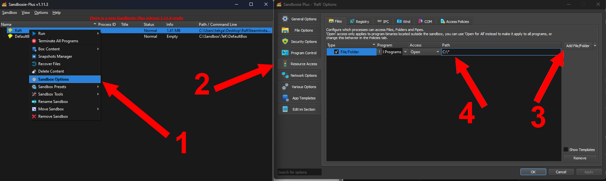
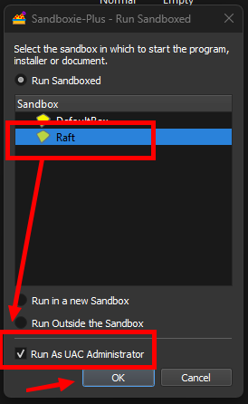

# How to run multiple raft instances

I'll guide you through running multiple Raft instances simultaneously. To begin, you'll need:

1. [**Sandboxie-Plus:**](https://sandboxie-plus.com/) Allows isolated program execution.
2. [**A Second Raft Copy**](https://store.steampowered.com/app/648800/Raft/)**:** You need 2 Raft accounts for running two instances.

Let's get started!

## **1. Installing Sandboxie-Plus**

* Download and install Sandboxie-Plus from [here](https://sandboxie-plus.com/).
* Creata a new sandbox, name it as you like and add an access to your drive as shown below.

<figure><figcaption></figcaption></figure>


We recommend granting access to the entire drive in the isolated environment because it includes crucial folders like AppData, world directories, Raft Settings, and Mod Loader files.


## **2. Duplicating Steam Software**

* Create a new folder for the second Steam.
* Copy your steam folder in this folder (You may want to remove other games than raft in the destination folder).

## **3. Installing Steam in Isolated Environment**

* Run steam.exe in the second Steam folder using Sandboxie-Plus.
* Start Steam in the isolated environment and select "Run As UAC Administrator".

<figure><figcaption></figcaption></figure>

## **4. Starting Raft**

* Log in with your second Steam account.
* Start Raft with "-rml" or through RMLLauncher opened inside sandboxie too; it should work seamlessly!
