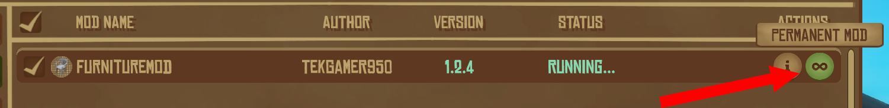

# Installing a mod

## 1. Installing the mod loader

If you haven't done so already, please install RaftModLoader. \
For detailed explanations, refer to our guide on this topic.


[installing-raft-mod-loader](../installing-raft-mod-loader/)


## 2. Finding mods

To search and discover mods of your choice, we strongly recommend utilizing [our mods directory](https://www.raftmodding.com/mods). Simply scroll through the page and click on the mod you're interested in.\
Alternatively, you can find a list of the most popular mods on [our home page](https://www.raftmodding.com/).

.png>)

## 3. Installing a mod

On a mod's page, you can find all the information about the mod.\
**To install it, just click the large green '**_**Install Mod**_**' button.**

.png>)

Your browser may prompt you to allow raftmodding.com to open the Raft Mod Loader for installing a mod. **Click '**_**Open**_**' to proceed.**

 (1).png>)


If nothing happens, you can download the mod's .rmod file by clicking '_**Download this mod**_' and place it in the '_**mods**_' folder inside your Raft directory.


## 4. Allowing the mod installation

Now, the Raft Mod Installer should open.\
It will display the mod that is about to be installed and ask you once again if you want to proceed. **Click '**_**Yes, Install It**_**' to begin the installation.**

.png>)

## 5. Loading the mod

We've installed the mod! To load it, start the game using the launcher's 'Play' button.\
In the game, go to 'Mod Manager' tab. **Click '**_**Load Mod**_**' if available**; for Permanent Mods, no action is needed.

.png>)

## 6. You are done !

If everything worked out, the mod status will be green, and the text should say '_**RUNNING...**_' as shown below.

.png>)


There you have it! Your first mod is now successfully installed and active!


## **Troubleshooting**

Encountering issues? Don't worry! If anything isn't working as expected, join our [Discord server](https://www.raftmodding.com/discord), and we'll be more than happy to assist you.
