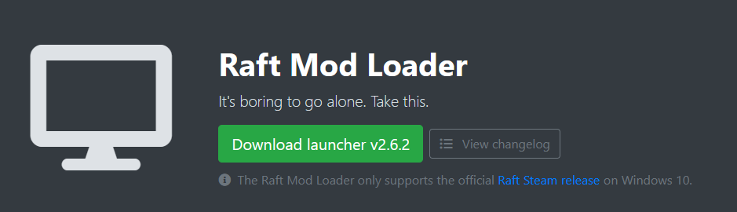

# Installing Raft Mod Loader

## 1. Downloading the Launcher

**Start by downloading our latest launcher version from** [**here**](https://www.raftmodding.com/loader)**.**\
After downloading, you can place it anywhere you prefer.\
We suggest keeping it on your desktop or another easily accessible location for convenience.

<figure><figcaption>
Press the green button to download the latest launcher version from our website.
</figcaption></figure>

## 2. Terms of Service

**Open the downloaded file (**_**RMLLauncher.exe**_**) to launch the program**.\
When you start it for the first time, you'll see our Terms of Service.\
**You must agree to them to use our software.**\
Click 'Agree' to confirm your acceptance.

If you have privacy concerns or questions, don't hesitate to reach out to us on [Discord](https://www.raftmodding.com/discord).

.png>)

## 3. Installation

After accepting the Terms of Service, the launcher will automatically download and install all the necessary files, as displayed below. **You don't need to take any action; simply wait**.\
The process is usually quick.

.png>)

## 4. Launching modded Raft

After the launcher has downloaded and installed all the necessary files, a "**Play**" button will appear, as depicted below.\
**Press this button to start the game using the mod loader**.

.png>)


Remember, whenever you want to play with mods, initiate the launcher and press the button to launch the game with the mod loader.


## 5. Inside the game

After the game has loaded, you will find a **new menu in the Raft main menu**, as illustrated below. If the new menu does not appear in-game, please refer to our troubleshooting guide here.

<figure><figcaption></figcaption></figure>

## **6. Installing your first mod**


Congratulations! If you've reached this point, **you've successfully installed RaftModLoader**!\
\
Now, **you are ready to install some actual mods**.


If something isn't working as expected, maybe take a look at our troubleshooting guide:


[troubleshooting](troubleshooting/)

