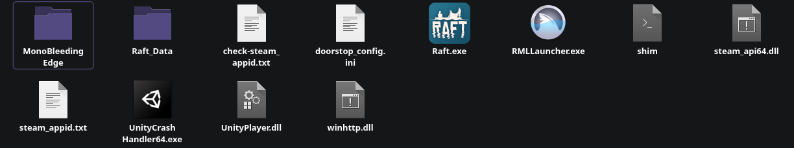
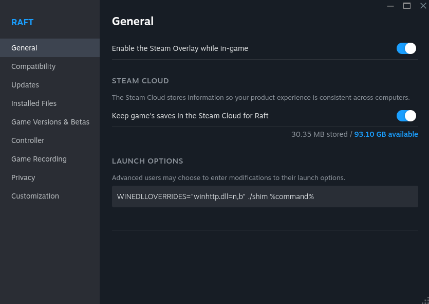
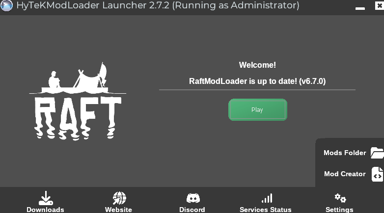

# Linux or Steam Deck installation

Setting up Raft Mod Loader is now easier than ever due to the proton compatibility layer built into Steam. This guide aims to show you how you can achieve this on your own Linux-based machine.

First, a starting note for the Steam Deck users: To access the Linux Desktop on the Steam Deck do the following: [https://help.steampowered.com/en/faqs/view/0872-C5FA-C31E-FE63](https://help.steampowered.com/en/faqs/view/0872-C5FA-C31E-FE63)

Another general note: the install button on the Raftmodding website unfortunately does not work, so you will have to add the mods to the mod folder manually.

Now let's get started 😊

### 1. Setting up our game directory

First download the shim file from [https://github.com/FranzFischer78/proton-custom-exe-shim](https://github.com/FranzFischer78/proton-custom-exe-shim) and download the Raft Mod Launcher from [https://www.raftmodding.com/download](https://www.raftmodding.com/download).

Next place both of the downloaded files into your Raft game folder usually located at /home/$USER/.steam/steam/steamapps/common/Raft.&#x20;


The .steam folder will be hidden if you have 'Show Hidden Files' disabled in your file manager so you will need to enable the setting.


The Raft folder should now look like this:

<figure><figcaption></figcaption></figure>

### 2. Setting up the launch parameters inside of Steam

First open Steam. Next go into your Steam Library, go to Raft, right-click onto the game and click on properties.

On the general tab you'll find an input field called launch options. Add the following into that field:

```bash
WINEDLLOVERRIDES="winhttp.dll=n,b" ./shim %command%
```

<figure><figcaption></figcaption></figure>

### 3. Preparing the target file

Now startup Raft on Steam. The game should start up as usual. Close it is done starting.

Go back into your Raft game directory. There should now be a new file called 'target'. Open the file and replace Raft.exe with RMLLauncher.exe as seen below


### 4. Launching the game with mods

Startup Raft on Steam. You should now see the mod launcher coming up. Go through the setup process until you reach the following window.&#x20;

<figure><figcaption></figcaption></figure>

Press play and the game should start with mods! You should see this mod menu once the game reaches the main menu:

<figure><figcaption></figcaption></figure>


If you encounter any issues or the guide doesn't seem to work for you, please visit the #support-tickets channel on our [Discord](https://www.raftmodding.com/discord).\
\
Our team is more than happy to assist you. 🙂

