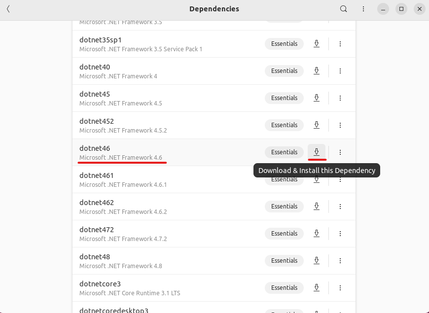

# Using Bottles

Starting note for the Steam Deck users: To access the Linux Desktop on the Steam Deck do the following: [https://help.steampowered.com/en/faqs/view/0872-C5FA-C31E-FE63](https://help.steampowered.com/en/faqs/view/0872-C5FA-C31E-FE63)

Now let's get started :)

1. First let's open bottles. If you don't have bottles installed on your system you can get it here: [https://usebottles.com/](https://usebottles.com/)
2.  Now let's create a new custom Bottle running on Soda:\

    <figure><figcaption></figcaption></figure>

3.  Once the Bottle is created, open it and click on dependencies:\

    <figure><figcaption></figcaption></figure>

    Then install .NET Framework 4.6:\

    <figure><figcaption></figcaption></figure>
4.  Next go back to your Bottle and click on "Install Programs..."\

    <figure><figcaption></figcaption></figure>

    and install Steam:\

    <figure><figcaption></figcaption></figure>

5.  Download the game on steam as usual and see if it runs. If the game or steam fails to start, try enabling dxvk in the bottle's settings (this can also be useful to improve the performance in general):\

    <figure><figcaption></figcaption></figure>

    If that still doesn't fix it (mostly on steam decks), try disabling steam runtime in the compatibility settings: \

    <figure><figcaption></figcaption></figure>

6.  Next we need to do one last thing before we're set. Back in the main menu of the Bottle, scroll down to "Legacy Wine tools" and open "Configuration":\

    <figure><figcaption></figcaption></figure>

    Then head over to the "Libraries" tab and enter the following in the field under "New override for Library": "\*winhttp"\
    \
    .png>)\
    \
    Click on "Add" -> "Apply" -> "Ok".
7.  Aaaand you're set! Now you just need to run the "RMLLauncher.exe" by clicking on "Run Executable": \

    <figure><figcaption></figcaption></figure>

8.  **ENJOY!!!**\

    <figure><figcaption>
The Raft Mod Loader main menu
</figcaption></figure>

P.S. Installing mods probably needs to be done manually by downloading the rmod files on the website and placing them in the "mods" folder next to the game executable.&#x20;


If you encounter any issues or the guide doesn't seem to work for you, please visit the            _#linux-support_ channel on our [Discord](https://www.raftmodding.com/discord).\
\
Our team is more than happy to assist you. 🙂

