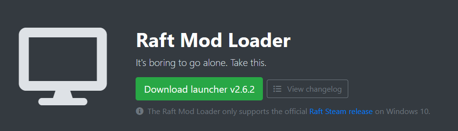

# Using Wine

## 0. Get Raft

Go to your Windows PC, find the Raft installation folder (explained [here](https://support.steampowered.com/kb_article.php?ref=7418-YUBN-8129)) and copy it over to your Linux computer. On my desktop it's placed in `~/Desktop/Raft`, so change the paths accordingly to where yours is located.

### 1. Download the Launcher

The same as you would do on Windows. Go to the [download page](https://www.raftmodding.com/download) and place it somewhere (for example, I placed it in `~/Desktop/Raft` - my Raft folder).



### 2. Install Mono and .NET 4.6

First of all, if you haven't already, install `winetricks`. On Ubuntu it's just `sudo apt install winetricks`.

Then download Mono 5.0 .MSI from [this link](https://dl.winehq.org/wine/wine-mono/5.0.0/wine-mono-5.0.0-x86.msi) and run `wine uninstaller` to launch the Add & Remove Software dialog. Point it to the downloaded installer and wait until it completes. After installing Mono, you need another thing: .NET 4.6. It can be installed from Terminal using `winetricks dotnet46`. It'll warn you about Windows Modules Installation Service missing but that's not a problem.

### 3. (Recommended) Install DXVK for better performance

If your graphics card supports Vulkan rendering then you shouldn't skip this step. Grab a release from [here](https://github.com/doitsujin/dxvk/releases/latest), unpack the archive to `~/Downloads/` and run this in Terminal from the `~/Downloads/dxvk_x.y.z` directory where x.y.z is the version:

```bash
WINEPREFIX="$(dirname ~/.wine)/.wine" ./setup_dxvk.sh install
```


### 4. Use RaftModLoader as you're on Windows

Run RMLLauncher via Wine: `wine64 ~/Downloads/RMLLauncher.exe`. It'll ask you for your Raft folder. From what I've checked, updating is fine, injections work and Raft starts.&#x20;

## Known Issues

### Raft won't respond after Alt+Tab

There's nothing I can do to that - it's a issue that happens on many other Unity games, especially when they're running on Wine. From what I've seen, changing focus to a window on another monitor doesn't trigger this.



If you encounter any issues or the guide doesn't seem to work for you, please visit the            _#linux-support_ channel on our [Discord](https://www.raftmodding.com/discord). Also maybe try the Bottles guide (it works better).\
\
Our team is more than happy to assist you. 🙂

