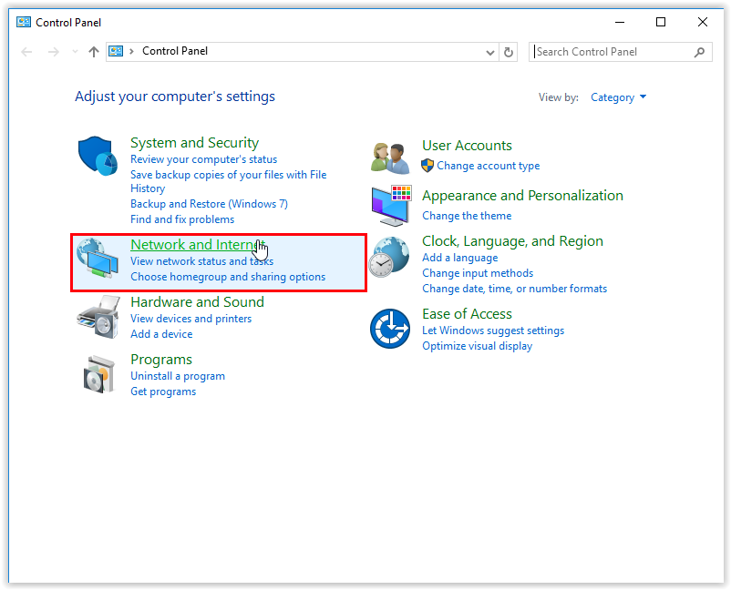
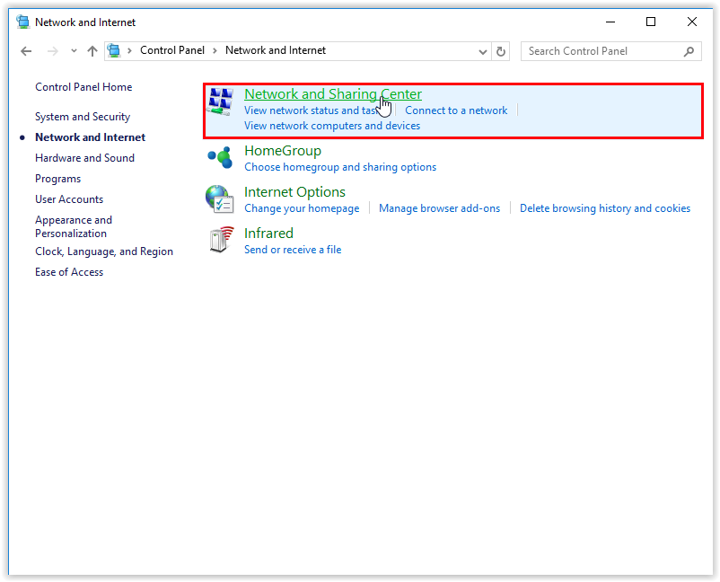

# Troubleshooting

If installing the mod loader is not working as expected, don't worry. Please take a look at the following document which describes some of the more common issues with installing the mod loader. If none of this works, please join our [Discord](https://raftmodding.com/discord) and we will be happy to help you!

## What's wrong?

First of all, we need to find out what's the problem. Which of the following descriptions describes your problem best? If an error popped up, try to find the headline with the text describing the error.

* [The menu inside the game does not show up](troubleshooting.md#menu-not-showing-up)
* ["An error occured while fetching for updates":](troubleshooting.md#an-error-occured-while-fetching-for-updates)\
  .png>)\
  or\
  .png>)\
  or\
  .png>)
* [The game crashes on startup](troubleshooting.md#the-game-crashes-on-startup)
* [There's an error counter going up very fast in the bottom right hand corner of the game](troubleshooting.md#theres-an-error-counter-going-up-very-fast-in-the-bottom-right-hand-corner-of-the-game)\
  .png>)
* [Other / My problem could not be solved with this guide](troubleshooting.md#other)

## The menu inside the game does not show up 

This is a fairly common issue so don't worry. Please do the following steps:

#### 1. Open the launcher

Close Raft if it is still running and open the launcher application as **administrator**.

#### 2. Open the settings

Click on Settings:gear:icon to open the Launcher settings.

#### 3. Change the starting method

In the settings, you need to enable **`Start Game From Steam`**:

<figure><figcaption></figcaption></figure>

#### **4. Start the game**

Now, close the Settings and press `Play` to start the game.

#### 5. Did it work?

If this worked, you should now see the modding menu inside the game. If you can not see the menu as shown below, try excluding the mod loader from your antivirus:


[configuring-your-antivirus](configuring-your-antivirus/)


<figure><figcaption>
The mod menu inside of the game
</figcaption></figure>

## "An error occured while fetching for updates"

There are multiple reasons this issue can be happening. The first and most likely one is your antivirus interfering. Follow the linked guide and see if it helps:


[configuring-your-antivirus](configuring-your-antivirus/)


If that doesn't help, don't worry we got you :wink:

1.  **Disabling IPV6**\
    \
    This issue might be caused by IPV6 being enabled on your computer. A Windows bug can cause the requests to fail when going through ipv6 and it can be safely disabled. \
    \
    1\. Open the **Control Panel** (through the Cortana search box for example).\
    2\. Open **Network and Internet**.

    <figure><figcaption></figcaption></figure>

    3\. Open **Network and Sharing Center**.

    <figure><figcaption></figcaption></figure>

    4\. Click **Change Adapter Settings**.\

    <figure><figcaption></figcaption></figure>

    5\. Right-click your connection and go to **Properties**.\

    <figure><figcaption></figcaption></figure>

    6\. Uncheck the box next to **Internet Protocol Version 6 (TCP/IPv6) to disable it.**\

    

    <figure><figcaption></figcaption></figure>

    

    7\. Select **OK to confirm** the change.\

    

    <figure><figcaption></figcaption></figure>

    

    8\. **Restart the computer** and try again running the launcher.&#x20;

2.  **If disabling IPV6 didn't fix your issue you can try changing your DNS**\
    \
    1\. Let's check if that's the issue first. **Open your command prompt** by **typing CMD** in the Cortana search bar for example and **select "Run as administrator"**:\

    <figure><figcaption></figcaption></figure>

    2\. **Run the following commands**: `nslookup raftmodding.com` and `nslookup raftmodding.com 8.8.8.8`\

    

    <figure><figcaption></figcaption></figure>

    

    If the ip adresses are different that means that there's an issue with the DNS and it might be blocking the Raftmodding requests.\
    \
    3\. We will **change the DNS** to one that is not blacklisting our website like the Google DNS. Here's a guide on how to setup the Google DNS on your system: [https://www.whatismyip.com/google-dns/](https://www.whatismyip.com/google-dns/)\
    \
    4\. Once you're done setting up the DNS make sure to **restart the computer** and try again running the Mod Launcher. You might also need to **change the DNS on your router**. The steps will be very dependent on your router.&#x20;

## The game crashes on startup

Same steps as for [The menu inside the game doesn't show up.](troubleshooting.md#menu-not-showing-up)

## There's an error counter going up very fast in the bottom right hand corner of the game

In the following, we will **verify the files' integrity**. This is a Steam tool that allows checks and repairs broken game files.

1. Open Steam and open the _Library_ tab.
2. Right-click _Raft_ and select _Properties_ in the pop-up-menu.
3. In the menu, select the _Local files_ tab.
4. Click on the _Verify integrity of game files_ button.
5. If the tool finds any broken files, it will automatically repair them.
6. Once done, you can close the windows.
7. Now, try to open the Launcher again.
8. Does it work now? If the error keeps coming up, this might be related to your Antivirus program.

_For visual guidance, check out the_ [_Steam Support article_](https://support.steampowered.com/kb\_article.php?ref=2037-QEUH-3335) _about this topic._


If you can't solve this problem with this guide, make sure to [contact us](troubleshooting.md#other) and we'll be happy to help you.


## Other / My problem could not be solved with this guide 

It seems like your problem is a bit uncommon. But don't worry, we'll be happy to provide support on our [Discord server](https://raftmodding.com/discord). :blush:
