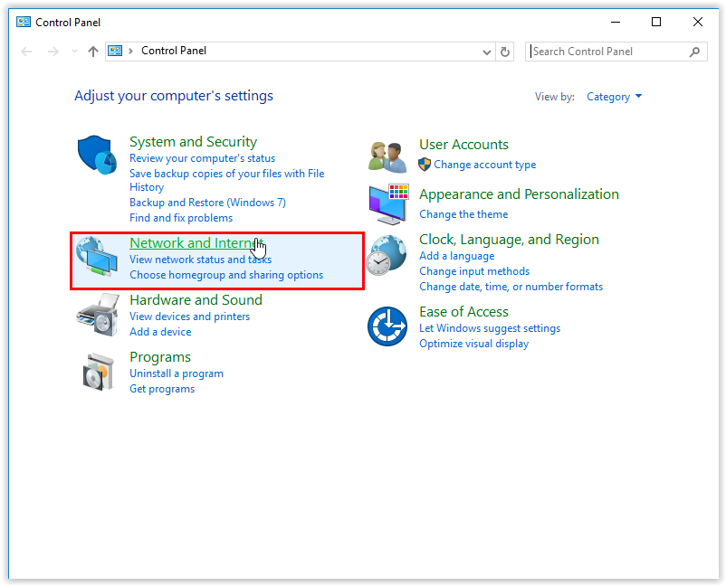

# Disabling IPV6

This issue might be caused by IPV6 being enabled on your computer. A Windows bug can cause the requests to fail when going through ipv6 and it can be safely disabled. \
\
1\. Open the **Control Panel** (through the Cortana search box for example).\
2\. Open **Network and Internet**.

<figure><figcaption></figcaption></figure>

3\. Open **Network and Sharing Center**.

<figure><figcaption></figcaption></figure>

4\. Click **Change Adapter Settings**.

<figure><figcaption></figcaption></figure>

5\. Right-click your connection and go to **Properties**.

<figure><figcaption></figcaption></figure>

6\. Uncheck the box next to **Internet Protocol Version 6 (TCP/IPv6) to disable it.**

<figure><figcaption></figcaption></figure>

7\. Select **OK to confirm** the change.

<figure><figcaption></figcaption></figure>

8\. **Restart the computer** and try again running the launcher.&#x20;

