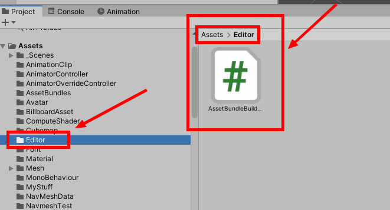
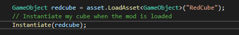

# How to create an AssetBundle

Let's get started with the requirements! \
For this tutorial you will need the same requirements as the first tutorial.

**1)** First, create a new Unity project with the same version as the one required in [**How to create a mod project**](https://api.raftmodding.com/modding-tutorials/how-to-create-a-mod-project).

**2)** Then once the first step is done, download [this file](https://fastdl.raftmodding.com/AssetBundleBuilder.zip) and place it into your Unity Project as shown below. This will allow you to build your asset bundle file. &#x20;

<div align="left">



</div>

**3)** Add your stuff to the asset bundle as shown below.

<div align="left">


</div>

**4)** Once you have everything in your assetbundle, build it by right clicking anywhere and clicking on **Build AssetBundles** as shown below. &#x20;

<div align="left">


</div>

**5)** If your assetbundle has succeeded building you should be able to find it in **Assets/AssetBundles**; Once you found it, copy it into your mod project folder where your .cs files and your modinfo.json file are located as shown below. &#x20;

 (1).png>)

**6)** Now let's load it into the game using our previous mod made in the [**How to create a mod project** ](broken-reference)tutorial. Open your mod project and change your start method type from **`void`** to **`IEnumerator`** and copy the code below into the start method as shown below; You will also need to create a new variable in your mod to be able to access the asset bundle from anywhere in your mod.



 (1).png>)


If**`IEnumerator`** is underlined in red, simply add **`using System.Collections;`**at the top of your mod file.




```csharp
AssetBundle asset;

public IEnumerator Start()
{
    AssetBundleCreateRequest request = AssetBundle.LoadFromMemoryAsync(GetEmbeddedFileBytes("tutorial.assets"));
    yield return request;
    asset = request.assetBundle;
    
}
```



**7)** Loading an asset bundle is good, but we also need to unload it when we unload our mod. So, to do that in your _**`OnModUnload`**_ method simply add **`asset.Unload(true);`** as shown below. &#x20;

.png>)

**8)** Now, to load something from our asset bundle simply use **`asset.LoadAsset<T>("assetname")`** for example to load the _**RedCube**_ that i added into the example asset bundle earlier i can just do **`asset.LoadAsset<GameObject>("RedCube")`** as shown below.

<div align="left">



</div>

If you done everything correctly your asset should now be in the game. For example my red cube spawned in the mainmenu :smiley:&#x20;


And here is it! As this can be a bit complicated if you encounter any issue or if you are blocked at a specific step, feel free to join our [Modding Discord](https://www.raftmodding.com/discord) and ask for help in [#support](https://discordapp.com/channels/451507895075471383/636994378618896436).
